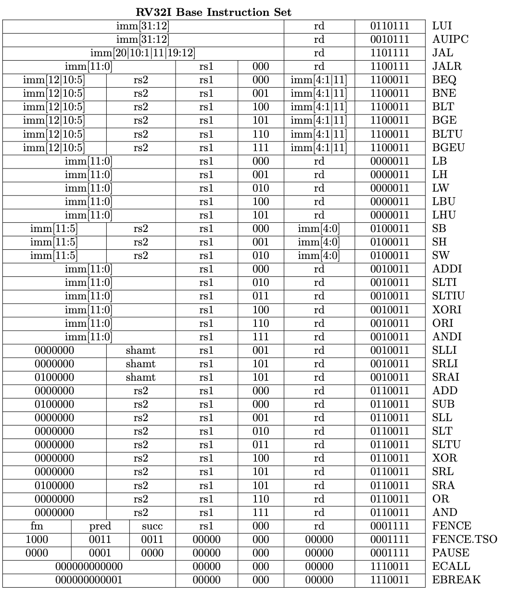

| Лабораторная работа №3    | Б05                           | Архитектура компьютера |
| ------------------------- | ----------------------------- | ---------------------- |
| Кэш и кодирование команд  | Габитов Булат Радикович       | 2024                   |
## Инструментарий
- **Язык программирования**: Python 3.12.6

## Что реализовано
Смоделирована работа процессора и кэша при выполнении кода на RISC-V с политиками вытеснения LRU и bit-pLRU. Дополнительно реализован перевод входного asm-кода в машинный код.

## Описание

### Полученные параметры системы

| Параметр         | Значение (с единицами измерения) |
|------------------|----------------------------------|
| MEM_SIZE         | 262144 байт                      |
| ADDR_LEN         | 18                               |
| CACHE_WAY        | 4                                |
| CACHE_TAG_LEN    | 9 битов                          |
| CACHE_INDEX_LEN  | 3 бита                           |
| CACHE_OFFSET_LEN | 6 битов                          |
| CACHE_SIZE       | 2048 байт                        |
| CACHE_LINE_SIZE  | 64 байта                         |
| CACHE_LINE_COUNT | 32                               |
| CACHE_SETS       | 8                                |

### Расчёт

- **ADDR_LEN** = 18 — длина адреса (в битах)
- **CACHE_INDEX_LEN** = 3 — длина индекса блока кэш-линий (в битах)
- **CACHE_LINE_SIZE** = 64 — размер кэш-линии (в байтах)
- **CACHE_LINE_COUNT** = 32 — количество кэш-линий

#### Формулы

- `MEM_SIZE` = \(2^{\text{ADDR\_LEN}}\)  
Понятно, что размер памяти - это \(2^{\text{количество ячеек адреса}}\).

- `CACHE_SIZE` = `CACHE_LINE_SIZE` × `CACHE_LINE_COUNT`  
Размер кэша, без учёта служебной информации (в байтах): количество кэш линий, умноженное на их размер.

- `CACHE_SETS` = \(2^{\text{CACHE\_INDEX\_LEN}}\)  
Количество блоков кэш-линий - это \(2^{\text{количество ячеек в индексе блока кэш-линий}}\).

- `CACHE_WAY` = \(\frac{\text{CACHE\_LINE\_COUNT}}{\text{CACHE\_SETS}}\)  
Ассоциативность. То есть размер одного кэш блока: количество линий / количество блоков.

- `CACHE_OFFSET_LEN` = \(\log_2(\text{CACHE\_LINE\_SIZE})\)  
Наша память разбивается на блоки по `CACHE_LINE_SIZE`, и информация в кэш записывается блоками. Каждому адресу соответствует блок:

address -> [address - address % 64, address - address % 64 + 64)

Поэтому на последние `CACHE_OFFSET_LEN` битов у адреса можно не смотреть.

- `CACHE_TAG_LEN` = `ADDR_LEN` - `CACHE_OFFSET_LEN` - `CACHE_INDEX_LEN`


# Описание реализации

## Cache
В данной реализации кэша созданы следующие классы для представления кэша и управления политиками вытеснения:

# Описание классов кэш-линий

## LruCacheLine
Класс `LruCacheLine` реализует кэш-линии с политикой вытеснения LRU (Least Recently Used). Этот алгоритм предназначен для хранения ограниченного объёма данных. При этом из хранилища вытесняется информация, которая не использовалась дольше всего.

### Алгоритм работы
1. Когда программа обращается к данным, она проверяет, есть ли они в кэше.
2. Если данные есть, их временная метка обновляется.
3. Если данных нет, они добавляются в кэш.
4. Пока в кэше есть место, новые данные добавляются туда без вытеснения имеющихся.
5. Когда место заканчивается, перед добавлением новых данных алгоритм проверяет временные метки.
6. Он находит элемент с самой старой временной меткой.
7. Этот элемент удаляется из кэша, а на его место добавляется новая информация.

### Методы класса `LruCacheLine`
- **`add(address)`**: 
  - Добавляет адрес в кэш. 
  - Если адрес уже существует, он обновляет порядок доступа.
  - Если кэш заполнен, удаляется наименее используемый адрес.
  - Возвращает `True` / `False` в зависимости от попадания в кэш.

---

## BitpLruCacheLine
Класс `BitpLruCacheLine` реализует кэш-линии с политикой bit-pLRU (Probabilistic Least Recently Used). 

### Алгоритм работы bit-pLRU
1. Для каждой строки кэша сохраняется один бит статуса (MRU-бит).
2. При обращении к строке MRU-бит устанавливается в 1, указывая на то, что строка использовалась недавно.
3. Когда последний оставшийся 0 бит набора статусов устанавливается в 1, все другие биты сбрасываются до 0.
4. При промахе кэша заменяется левая строка, у которой MRU-бит равен 0.
5. Таким образом, алгоритм оставляет в кэше данные, которые использовались недавно, а те, к которым обращались давно, вытесняет.

### Методы класса `BitpLruCacheLine`
- **`add(address)`**: 
  - Аналогично методу `add` в классе `LruCacheLine`, но с использованием механизма описанного выше для управления доступом и вытеснением данных.

- **`Cache`**: Основной класс, который управляет коллекцией кэш-линий. Он отслеживает количество попаданий в кэш и общее количество обращений, а также предоставляет методы для добавления адресов в кэш.

- **`LruCache` и `BitpLruCache`**: Подклассы `Cache`, которые используют соответствующие классы кэш-линий для реализации различных политик вытеснения.


Класс `Cache` моделирует систему кэш-памяти, которая отслеживает попадания и промахи для инструкций и памяти. Он использует кэш-строки, организованные в наборы, для эффективного управления данными.


- **Параметры:**
  - `CacheLine`: Класс, определяющий структуру и поведение отдельных кэш-строк.
  
- **Атрибуты:**
  - `self.caches`: Список кэшей, инициализированный на основе количества блоков кэша.
  - `self.cache_hit_instruction`: Счетчик попаданий в кэш для инструкций.
  - `self.cache_total_instruction`: Счетчик общего количества обращений к инструкциям.
  - `self.cache_hit_memory`: Счетчик попаданий в кэш для памяти.
  - `self.cache_total_memory`: Счетчик общего количества обращений к памяти.

## Методы

### `add(self, address: int, type="inst") -> bool`

Добавляет адрес в кэш и определяет, является ли это попаданием или промахом.

- **Параметры:**
  - `address` (int): Адрес в памяти, который необходимо добавить в кэш.
  - `type` (str): Тип доступа, либо `"inst"` для инструкций, либо `"mem"` для памяти. По умолчанию `"inst"`.

- **Возвращает:**
  - `bool`: Возвращает `True`, если доступ был попаданием, иначе `False`.

- **Описание:**
  - Вычисляет тег и индекс из адреса.
  - Обновляет счетчики попаданий в зависимости от типа доступа.
  - Генерирует ошибку (assert), если указан недопустимый тип доступа.

### `get_info(self)`

Получает статистику о производительности кэша.

- **Возвращает:**
  - Кортеж, содержащий:
    - `all_percent` (float): Общий процент попаданий по сравнению с общим количеством обращений.
    - `instruction_percent` (float): Процент попаданий для обращений к инструкциям.
    - `memory_percent` (float): Процент попаданий для обращений к памяти. Возвращает NaN, если не было обращений к памяти.


### Конфигурация
Кэш настроен с использованием следующих параметров:
- Ассоциативность: 4 (CACHE_WAY)
- Количество блоков: 8 (CACHE_SETS)
- Размер кэша: 2048 байт (CACHE_SIZE)
- Размер кэш-линии: 64 байта (CACHE_LINE_SIZE)

Кэш работает следующим образом:
1. При обращении к адресу вычисляется индекс блока и тег.
2. Если адрес уже присутствует в кэше, происходит "попадание" (cache hit), иначе — "промах" (cache miss), что может привести к вытеснению существующей линии в зависимости от политики.


## ISA

# Класс RiscVSimulator

## Обзор
Класс `RiscVSimulator` представляет собой простой симулятор архитектуры RISC-V 32I. Он предназначен для загрузки и выполнения инструкций, а также для управления регистрами, памятью и счетчиком команд (PC). Симулятор также включает механизмы кэширования LRU (Least Recently Used) для оптимизации извлечения инструкций и памяти.

## Определение класса

```python
class RiscVSimulator:
    def __init__(self):
        ...
    
    def load_instructions(self, filename):
        ...
    
    def correct_memory_address(self, address):
        ...
    
    def execute(self):
        ...
    
    def parse_and_execute(self, instruction: str):
        ...
```

## Атрибуты

- `registers`: Словарь, содержащий 32 регистра общего назначения (x0 до x31), инициализированные нулями.
- `memory`: Словарь, симулирующий пространство памяти для хранения инструкций.
- `pc`: Программный счетчик, инициализированный значением 0x10000.
- `lru_cache`: Экземпляр класса LruCache для кэширования.
- `bitp_lru_cache`: Экземпляр класса BitpLruCache для дополнительного кэширования.
- `memory_limit`: Булево значение, указывающее на наличие ограничения памяти.

## Методы


### load_instructions(filename: str) -> list
Загружает инструкции из файла в память симулятора.

Параметры:
- `filename`: Путь к файлу с инструкциями.

Возвращает:
- Список загруженных инструкций.


### execute() -> tuple
Выполняет загруженные инструкции.

Возвращает:
- Кортеж с информацией о состоянии кэшей LRU и BITP LRU.

### parse_and_execute(instruction: str)
Разбирает и выполняет отдельную инструкцию RISC-V 32I.

Параметры:
- `instruction`: Строка с инструкцией RISC-V 32I.

## Поддерживаемые инструкции

# Поддерживаемые инструкции RISC-V 32I

- `lui`: Load Upper Immediate
- `auipc`: Add Upper Immediate to PC
- `jal`: Jump and Link
- `jalr`: Jump and Link Register
- `beq`: Branch if Equal
- `bne`: Branch if Not Equal
- `blt`: Branch if Less Than
- `bge`: Branch if Greater or Equal
- `bltu`: Branch if Less Than Unsigned
- `bgeu`: Branch if Greater or Equal Unsigned
- `lh`: Load Halfword
- `lw`: Load Word
- `lb`: Load Byte
- `lbu`: Load Byte Unsigned
- `lhu`: Load Halfword Unsigned
- `sw`: Store Word
- `sb`: Store Byte
- `sh`: Store Halfword
- `addi`: Add Immediate
- `slti`: Set Less Than Immediate
- `sltiu`: Set Less Than Immediate Unsigned
- `xori`: Exclusive OR Immediate
- `ori`: OR Immediate
- `andi`: AND Immediate
- `slli`: Shift Left Logical Immediate
- `srli`: Shift Right Logical Immediate
- `srai`: Shift Right Arithmetic Immediate
- `add`: Add
- `sub`: Subtract
- `sll`: Shift Left Logical
- `slt`: Set Less Than
- `sltu`: Set Less Than Unsigned
- `xor`: Exclusive OR
- `srl`: Shift Right Logical
- `sra`: Shift Right Arithmetic
- `or`: OR
- `and`: AND
- `fence`: Fence Instruction (Memory Ordering)
- `ecall`: Environment Call (System Call)
- `ebreak`: Environment Break (Debugging)
- `mul`: Multiply
- `mulh`: Multiply High (Signed)
- `mulhsu`: Multiply High Signed/Unsigned
- `mulhu`: Multiply High Unsigned
- `div`: Divide (Signed)
- `divu`: Divide Unsigned
- `rem`: Remainder (Signed)
- `remu`: Remainder Unsigned


## Примечания

- Класс использует вспомогательные функции, такие как `clean_text()` и `to_int32()`
Их функционал реализуется в фалйе `functions.py`

```python
def to_int32(x: int): Переводит число или строку в типо int32
```

```python
def clean_text(text): 
Переводит каждую команду asm-файла на отдельную строчку
удаляет пустые строчки
```


# Кодирование инстукций в машинный код

## Обзор

Функция `encode_riscv_instruction` принимает инструкцию ассемблера RISC-V в качестве входных данных и возвращает ее соответствующее двоичное кодирование в виде 32-битной строки. Функция поддерживает различные типы инструкций, включая R-типа, I-типа, S-типа, B-типа, U-типа, J-типа, M-типа и SI-типа (неофициальный мой тип, обозначает команды `slli`, `srli`, `srai`).

## Подпись функции

```python
def encode_riscv_instruction(instruction: str) -> str:
```

### Параметры

- `instruction` (str): Строка, представляющая инструкцию ассемблера RISC-V для кодирования. Инструкция может включать операцию и ее операнды.

### Возвращает

- (str): 32-битная двоичная строка, представляющая закодированную инструкцию.

## Поддерживаемые типы инструкций

Функция поддерживает следующие типы инструкций:

### 1. **Инструкции R-типа**
  add, sub, sll, slt, sltu, xor, srl, sra, or, and
### 2. **Инструкции I-типа**
  addi, slti, sltiu, xori, ori, andi, lb, lh, lw, lbu, lhu
### 3. **Инструкции S-типа**
  sb, sh, sw
### 4. **Инструкции B-типа**
  beq, bne, blt, bge, bltu, bgeu
### 5. **Инструкции U-типа**
  lui, auipc
### 6. **Инструкции J-типа**
  jal, jalr
### 7. **Инструкции M-типа**
  mul, mulh, mulhsu, mulhu, div, divu, rem, remu
### 8. **Инструкции SI-типа**
  slli, srli, srai

## Специальные случаи

- Функция обрабатывает специальные инструкции такие как `"ecall"` и `"ebreak"` явно, возвращая предопределенные двоичные строки.
  
## Команды и их записи в двоичный формат




## Зависимости

Функция зависит от нескольких внешних переменных и функций, определенных в импортированных модулях:
- **`REGISTERS_ALIASES`**: Словарь, сопоставляющий имена регистров, именам решистров записаных в формате x_i
- **`instruction_opcode`**: Словарь, содержащий коды операций для различных инструкций.
- **`r_type_instructions`, `i_type_instructions` и т.д.**: Словари, содержащие специфические форматы инструкций.
- **`get_segment_bits`**: Утилита для извлечения битов из данного сегмента.
- **`reverse`**: Утилита для реверсирования строки или последовательности битов.


Аргументы программе передаются через командную строку. Набор возможных аргументов приведён в таблице ниже. Аргументы могут располагаться в любом порядке относительно друг друга.

------------------------------------- | -----------------------------------------------------------------
--asm  <имя_файла_с_кодом_ассемблера> | Параметр, через который передаётся файл с кодом на ассемблере, 
                                      | который необходимо исполнить.
------------------------------------- | -----------------------------------------------------------------
--bin <имя_файла_с_машинным_кодом>    | Параметр, указывающий имя файла, в который нужно записать 
                                      | результат перевода ассемблера в машинный код.
------------------------------------- | -----------------------------------------------------------------


Для запуска программы необходимо ввести команду

python3 main.py --asm <имя_файла_с_кодом_ассемблера> --bin <имя_файла_с_машинным_кодом>

